# ExpenseTracker
The Console App deployed through Heroku platform enables users to access, alter data 
for day to day expenses which are listed & can be selected from the number specified
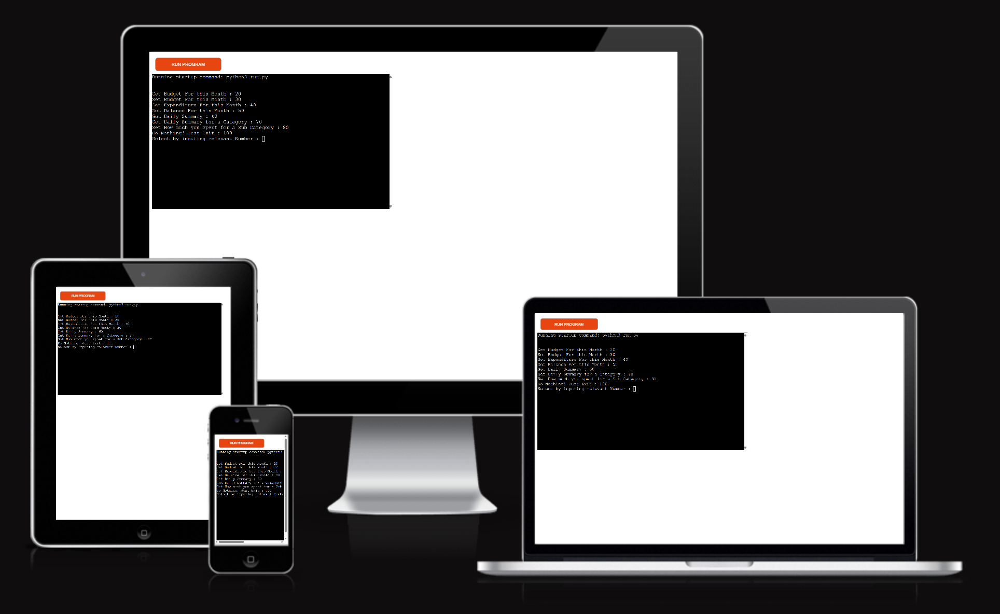

## Features
The site main features are to provide users to access & alter daily expenses

### Existing Features
- A Sheet is used from Google Sheets for linking the values & linked through google sheets api
- Three worksheets, named monthlyexpenses, dailysummary & subcategories are linked with this App
- Each time the App is launched, code checks for the last modified time of the Google Sheet and compare it to App launched time.
- If the date is not equal, then all data entries from previous day will be cleared from the worksheet subcategories and a new entry is added in dailysummary
- If the month is not equal, then a new entry is added in monthlyexpenses
The App displays all available options for user to select

- Available Options on Initial Screen
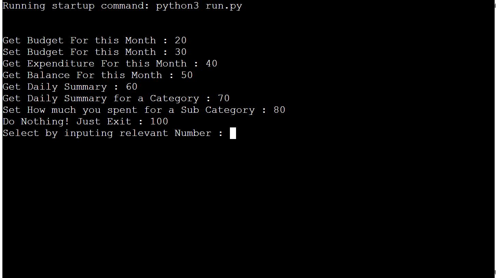

- Get the Budget set for the month
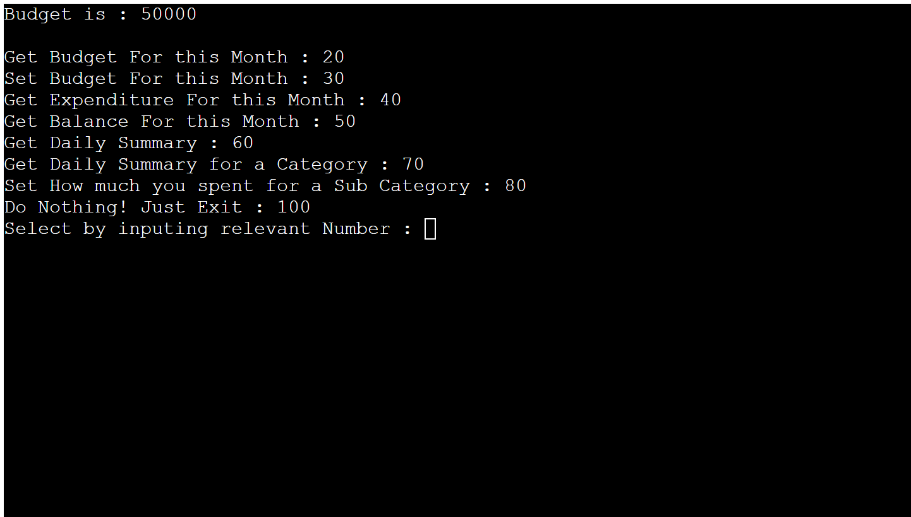

- Set the Budget for the month
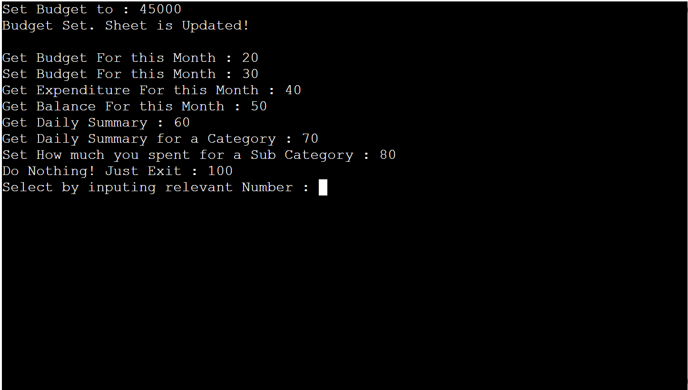

- Get the Total Expenditure for the month
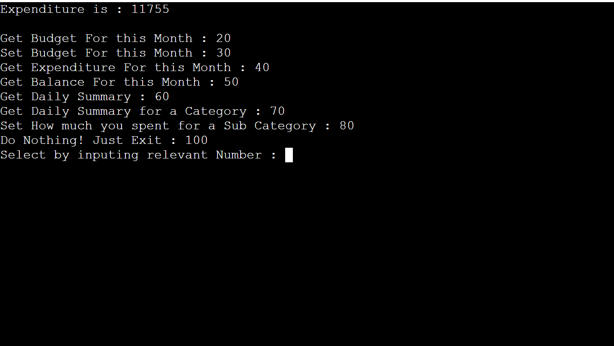

- Get the Balance amount for the month
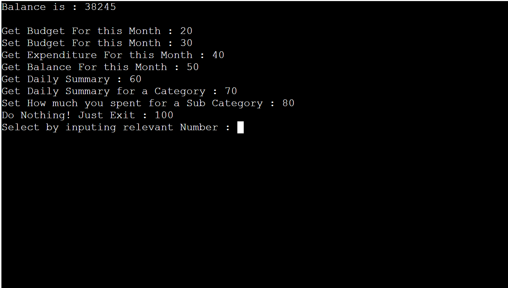

- Get the Complete Spending Summary for the day
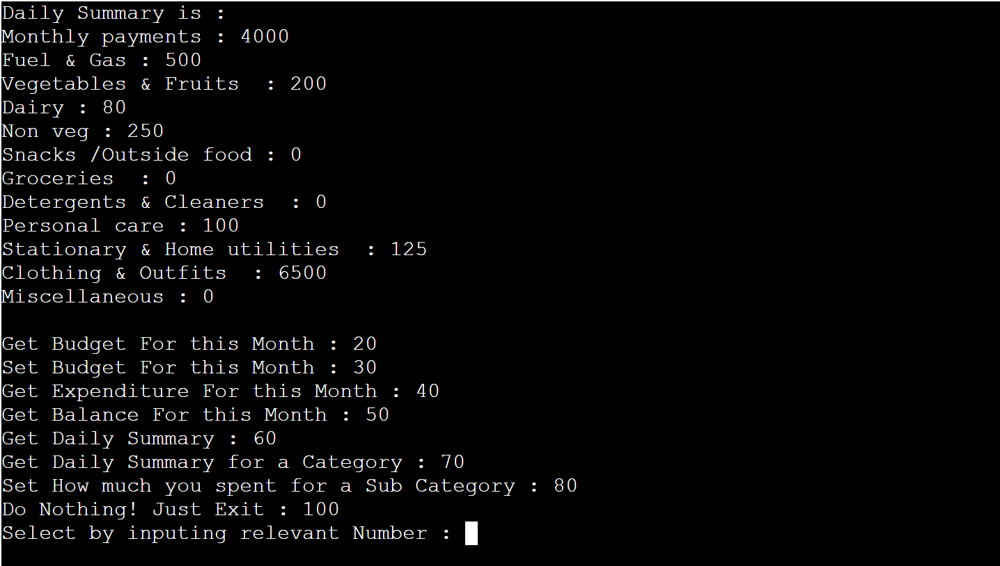

- Get the List of Categories to select a Sub Categories from
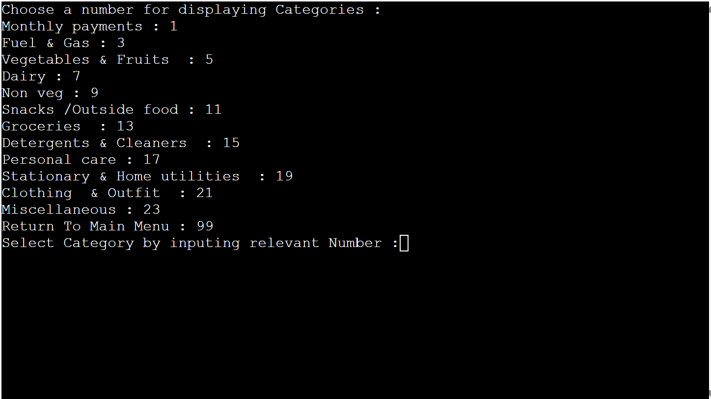

- Get the Sub Categories and the amount spent on each sub category
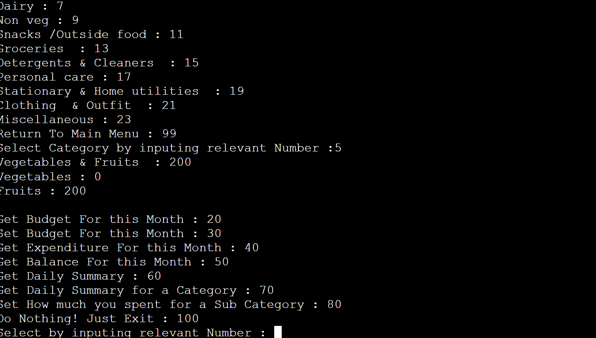

- Get the List of Categories to enter how much is spent for a specific sub category
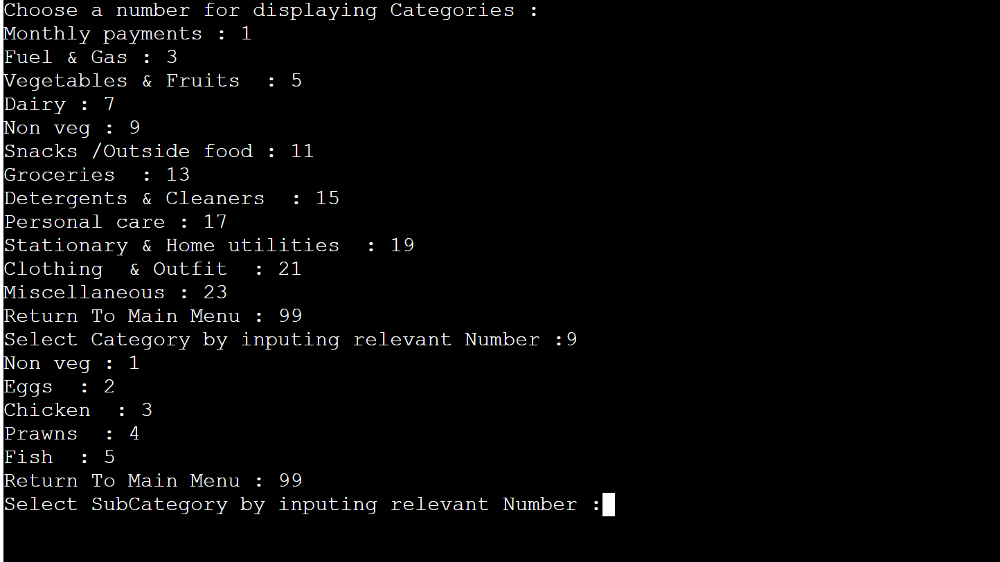

- Set the amount spent for a sub category
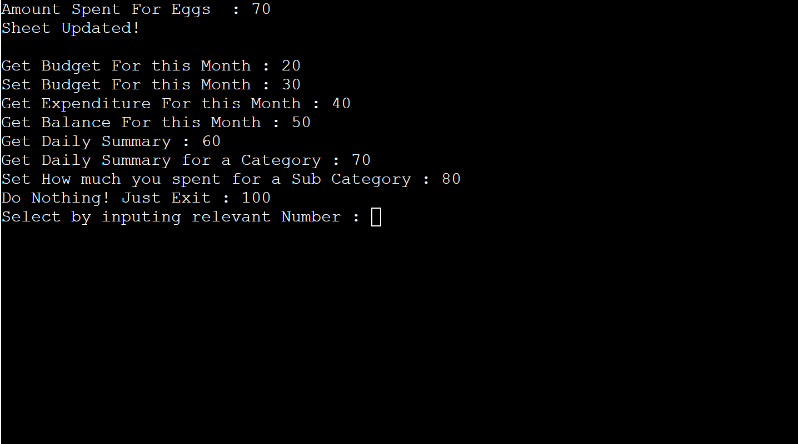

## Testing
Testing is done in the following way:

- Code is passed with out errors in PEP8 Linter
- Input validation is handled inside code which allows only valid input - which as of now is only typeof 'int'
- Tested in terminal from visual studio code & Heroku Terminal

## Validator Testing
- PEP8
    - No errors were returned from PEP8online.com
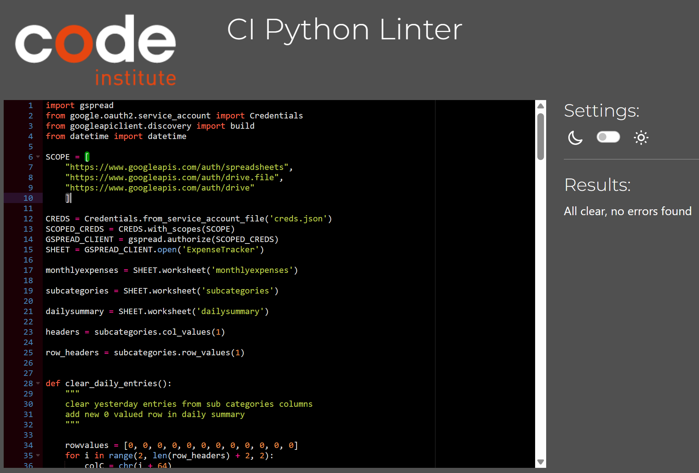

## Deployment
The Project is deployed using Code Institute's mock Terminal for Heroku

- Steps for Deployment
    - Fork or Clone this Repository
    - Create a new Heroku App
    - Set the buildbacks to python & NodeJS in the same order
    - Link the Heroku App to the Repository
    - Click on Deploy (optionally Automatic Deployment)

